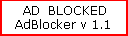



## AdBlocker 1\.1

### Description

Updated version of AdBlocker I submitted a few days back.Blocks ads on webpages making them load faster. Also displays an AD Blocked message in place of ads!
 
### More Info
 
The first submission I made really messed up the hosts file on some systems. If you have downloaded the previous version before then please check your systems hosts file and edit/delete it if required.

             |
---                |---
**Submitted On**   |2001-04-02 12:16:56
**By**             |[Abhishek Dutta](https://github.com/Planet-Source-Code/PSCIndex/blob/master/ByAuthor/abhishek-dutta.md)
**Level**          |Intermediate
**User Rating**    |4.8 (19 globes from 4 users)
**Compatibility**  |VB 6\.0
**Category**       |[Internet/ HTML](https://github.com/Planet-Source-Code/PSCIndex/blob/master/ByCategory/internet-html__1-34.md)
**World**          |[Visual Basic](https://github.com/Planet-Source-Code/PSCIndex/blob/master/ByWorld/visual-basic.md)
**Archive File**   |[AdBlocker 17818422001\.zip](https://github.com/Planet-Source-Code/abhishek-dutta-adblocker-1-1__1-22079/archive/master.zip)

